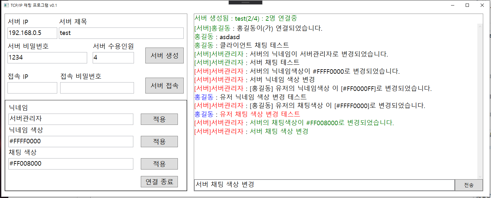

# ChatProgram
## 개요
</img>   
</img>   
네트워크 연습용으로 개발한 채팅프로그램입니다.   
1:N 통신을 지원하도록 개발하였습니다.

**1인 개발**로 진행하였습니다.   
**개발 기간**은 2020.03 ~ 2020.03 로 약 **3주** 입니다.     

## 핵심기술
**WPF**를 사용하여 개발되었으며, MVVM패턴을 사용하여 제작하였습니다.   
**TCP/IP** Socket 프로그래밍을 사용하여 통신을 구현하였습니다.   
원할한 통신을 위하여 자체 **통신 전용 프로토콜**을 개발하여 제작하였습니다.